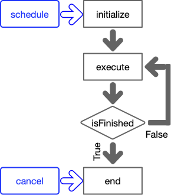

https://bovlb.github.io/frc-tips/commands/

# Commands

Although you can avoid it in some system cases, doing anything complex with your FRC robot will involve creating commands.  These respond to joysticks and buttons, run your autoonomous routines, and do other maintenance tasks.



In addition to the usual constructor, commands have four lifecycle methods: `initialize`, `execute`, `isFinished`, and `end`.  These methods are called by the scheduler (and never by you).  By overriding the implementation of these methods, you can change the behaviour of the command.

**Note**: These methods (as well as subsystem `periodic` methods and any `Trigger`s you have created) all run in a single shared thread, which is expected to run fifty times a second.  This means that they all share a total time budget of 20ms.  It is important that these commands execute quickly, so avoid using any long-running loops, sleeps, or timeouts.

### `void initialize()`
* Called once whenever a command is scheduled (including default commands).
* Use this to do anything your command needs to do once, such as running motors at constant speed, or initializing variables.  It's a good idea to print a log message in this command.
* Default implementation does nothing.

### `void execute()`
* Called every cycle for scheduled commands, in alternation with `isFinished`.
* Use this to do anything your command needs to do dynamically, like responding to joysticks or sensors, and updating internal state.  You can also use this to update SmartDashboard (although that is usually better done in subsystem `periodic`)
* Default implementation does nothing.

### `boolean isFinished()`
* Called every cycle for scheduled commands, in alternation with `execute`.
* Use this to tell the scheduler when your command is complete.
* Default implementation in `Command` returns `false`, so a command will run forever unless interrupted or canceled, but may be overridden (say in `InstantCommand`).

### `void end(boolean interrupted)`
* Called when a command is descheduled, which means that `isFinished` has returned `true`, or that the command has been interrupted or cancelled.  It's a good idea to print a log message in this command.
* Use this to tidy up after the command.  The typical usage is to stop motors.
* Default implementation does nothing.

**Note**: Generally commands exist in order to do something with a subsystem, like run motors.  It's very important that you never have two commands trying to control the same motor.  WPILIB's solution to this is call "subsystem requirements".  Generally you will pass the subsystems into the command's constructor (along with any other configuration) to be stored for later use.  In the constructor, you should also call `addRequirements(...)` with any subsystems used by the command.  In some complex cases, you may use a subsystem without requiring it, say because you are only reading sensor data and setting any motor speeds.

## Tricks

 A programmer needs to be familiar with the various command-related tricks available in WPILIB.  I've divided them here into six groups:
* Command groups: Classes that take one or more commands and execute them all.
* Commands for use in groups: Commands that are useful when using command groups.
* Runnable wrappers: Classes that turn runnables into commands
* Command decorators: Methods provided by all commands to connect or change them.
* Running commands: How to run a command
* Esoteric commands: Commands that are used only in specialized circumstances

These might seem a little complex and daunting, but the good news is that if you use them effectively your code will become simpler and easier to read.  There are many subtle gotchas about combining commands, and these help you to navigate them safely.

The scheduler will only run one command lifecycle method (`initialize`, `isFinished`, `execute`, `end`) or subsystem `periodic` at a time, so if you stay within this framework you don't have to worry about being thread-safe.

### Command groups

These classes group togather one or more commands and execute them all in some order.  They inherit the subsystem requirements of all of their sub-commands.  The sub-commands can be specified either in the constructor, or by subclassing and using `addCommands`.

* `SequentialCommandGroup`: Runs the sub-commands in sequence.
* `ParallelCommandGroup`: Runs the sub-commands in parallel.  Finishes when the slowest sub-command is finished
* `ParallelRaceGroup`: Runs the sub-commands in parallel.  Finishes when the fastest sub-command is finished.
* `ParallelDeadlineGroup`: Runs the sub-commands in parallel.  Finishes when the first command in the list is finished.

### Commands used in groups

The following commands are useful to build command groups.  Some of them take commands as arguments, and their subsystem requirements are inherited.

* `ConditionalCommand`: Given a condition (evaluated in `initialize`), runs one of two sub-commands.
* `SelectCommand`: Takes a mapping from keys to commands, and a key selector.  At `initialize`, the key selector is executed and then one of the sub-commands is run.
* `ProxyCommand`: This behaves exactly like the underlying command except that subsystem requirements are not inherited.
* `RepeatCommand`: Run the sub-command until it is finished, and then start it running again.
* `WaitCommand`: Insert a delay for a specific time.
* `WaitUntilCommand`: Insert a delay untill some condition is met.

### Runnable wrappers

Here are some wrappers that turn runnables (e.g. [lambda expressions](lambda.md)) into commands.  These can be used in command groups, but they are also used in `RobotContainer` to create command on-the-fly.  When using these methods, please remember to add the subsystem(s) as the last parameter(s) to make subsystem requirements work correctly.
* `InstantCommand`: The given runnable is used as the `initialize` method, there is no `execute` or `end`, and `isFinished` returns `true`.
* `RunCommand`: The given runnable is used as the `execute` method, there is no `initialize` or `end`, and `isFinished` returns `false`.  Often used with a decorator that adds an `isFinished` condition.
* `StartEndCommand`: The given runnables are used as the `initialize` and `end` methods, there is no `execute`m and `isFinished` returns `false`.  Commonly used for commands that start and stop motors.
* `FunctionalCommand`: Allows you you set all four life-cycle methods.  Not used if one of the above will suffice.

### Command decorators

These are methods that are provided by all `Command`s and allow you to create new commands that modify the underlying command in some way, or implicitly create command groups.  These can be used as an alternative way to write command groups, but are also used when creating commands on-the-fly in `RobotContainer`.

* `alongWith`: Runs the base command and the sub-command(s) in parallel ending when they are all finished (cf `ParallelCommandGroup`)
* `andThen`: Runs the base command and then the sub-commands or runnable (cd `SequentialCommandGroup`)
* `asProxy`: Blocks inheritance of subsystem requirements (cf `ProxyCommand`)
* `beforeStarting​`: Runs the sub-commands or runnable and then the base command (cf `SequentialCommandGroup`)
* `deadlineWith​`: Runs the base command and sub-commands in parallel, ending when the base command is finised (cf `ParallelDeadlineGroup`)
* `finallyDo`: Adds an (additional) `end` method to a command
* `raceWith`: Runs the base command and sub-commands in parallel, ending when end of them are finished (cf `ParallelRaceGroup`)
* `repeatedly`: Runs the base command repeatedly (cf `RepeatCommand`)
* `unless​`: Runs the command only if the supplied boolean is `true` (cf `ConditionalCommand`)
* `until`: Overrides the `isFinished` method.
* `withTimeout`: Adds a timer-based `isFinished` condition (cf `WaitCommand`)

(I have omitted a few of the more esoteric decorators for brevity.)

### Esoteric commands

These commands are used only in very specific circumstances.

* `NotifierCommand`:
* `PIDCommand`/`ProfiledPIDCommand`
* `RamseteCommand`
* `ScheduleCommand`
* `ProxyScheduleCommand`
* `WrapperCommand`
* `MecanumControllerCommand`
* `SwerveControllerCommand`
* `TrapezoidProfileCommand`

## Running commands

There are generally three ways to run a command:
* Bind it to a trigger, usually a joystick button
* Run it by default
* Run it in autonomous mode

### Triggers

Triggers are objects that run some command when some event takes place, like a button being pressed.  The easiest way to create a trigger is by using a `CommandJoystick` or `CommandXboxController`.  Trigger objects don't need to be stored.

```java
CommandJoystick joystick = new CommandJoystick(0);

joystick.button(1).toggleOnTrue(new MyCommand(...))
```

It is also possible to create triggers from any Boolean supplier:
```java
new Trigger(() -> subsystem.getLimitSwitch()).whileTrue(...)
```

Some trigger methods should be passed a command to run:
* `onFalse`: Starts the command when the trigger becomes false, e.g. the button is released.
* `onTrue`: Starts the command when the trigger becomes true, e.g. the button is pressed.
* `toggleOnFalse`: Starts or stops the command when the trigger becomes false.  Seldom used.
* `toggleOnTrue`: Starts or stops the command when the trigger becomes true.  For example, press a button and the intake starts running; it keeps running until the button is pressed a second time.
* `whileFalse`: Starts the command when the trigger becomes false, and stops it when the trigger becomes true.
* `whileTrue`: Starts the command when the trigger becomes true, and stops it when the trigger becomes true.  For example, the robot feeds balls into the shooter while the button is pressed, and stops when it is released.

Some trigger methods create new triggers:
* `and`: Combines the trigger with the parameter (often another trigger) to make a trigger than only activates when both triggers are true.
* `debounce`: Creates a new trigger than only activates when the underlying trigger has been true for some period of time.  This is useful for physical sensors and buttons that may be jittery.
* `negate`: Creates a new trigger that is only true when the underlying trigger is false.
* `or`: Combines the trigger with the parameter (often another trigger) to make a trigger than only activates when either trigger is true.

Of these, you will probably use `whileTrue`, `toggleOnTrue`, and `debounce` most often.

### Default commands

Sometimes you want a command to run all the time on some subsystem, unless you have something more specific to run.  This is the "default command" for that subsystem.

The most commonly encountered example of a default command is the "Arcade Drive" command, which connects a joystick to the drive subsystem.  This will run all of the time, except when you engage some autonomous driving routine.

To set the default command for a subsystem, simply call `setDefaultCommand()`.  Each subsystem can only have (at most) one default command.  When using default commands, it is important that all commands using that subsystem have their requirements set correctly; this ensures that the scheduler will deschedule the default command when they are scheduled.

```java
// in RobotContainer.java, in configureBindings()
m_driveSubsystem.setDefaultCommand(
    new ArcadeDriveCommand(m_driveSubsystem,
        () -> m_joystick1.getX(), // double supplier for turn
        () -> m_joystick1.getY()); // double supplier for speed
```

### Autonomous commands

TODO

## See also

 * [Binding Commands to Triggers](https://docs.wpilib.org/en/stable/docs/software/commandbased/binding-commands-to-triggers.html)
 * [Command Compositions](https://docs.wpilib.org/en/stable/docs/software/commandbased/command-compositions.html)
 * [Command interface](https://github.wpilib.org/allwpilib/docs/release/java/edu/wpi/first/wpilibj2/command/Command.html)
