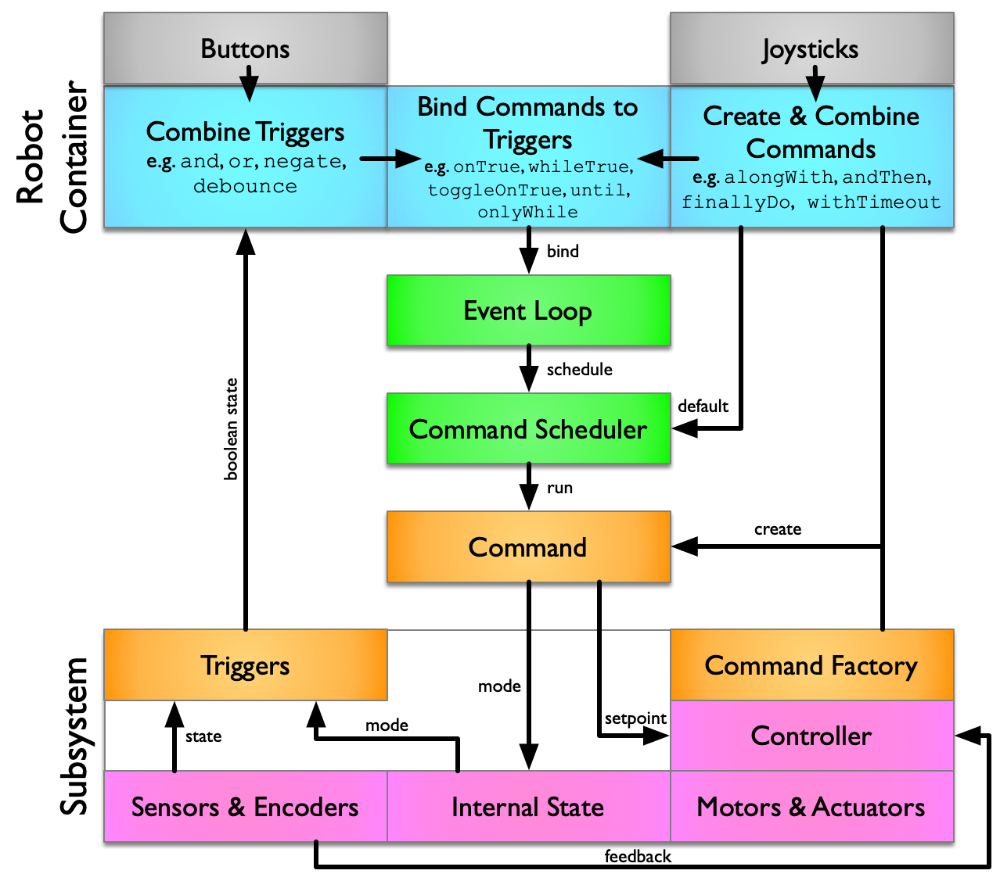
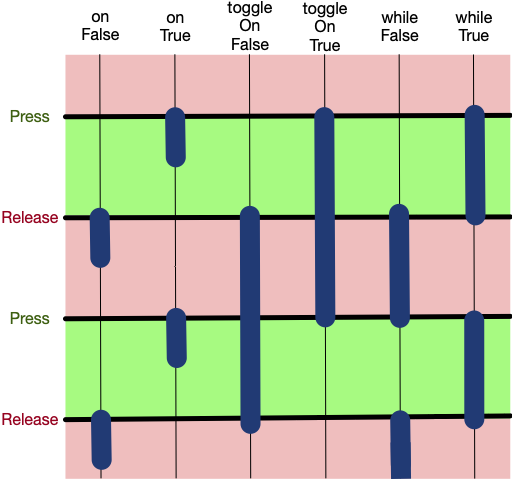

# Best Practices for Command-Based Programming

In May 2024, [Oblarg posted an article on Chief Delphi](https://www.chiefdelphi.com/t/command-based-best-practices-for-2025-community-feedback/465602?u=bovlb) that laid down some principles for best practices to follow when doing command-based programming.
Read the original post for the details, but it can be summarised in three key points:
* Control subsystems using command factories 
* Get information from subsystems using triggers
* Co-ordinate between subsystems by binding commands to triggers

The idea is to reduce dependencies between subsystems and gather all cross-subsystem behaviour in one place.
This makes your code easier to write, easier to maintain, less likely to have bugs, and more reusable.

## Summary


<a href="main-diagram-dark.png"></a>

This diagram summarises the architecture.  Starting at the bottom:

* The pink boxes are the private components of the subsystem, not directly accessible from outside.
* The orange boxes represent the public API of the subsystem.
  * State is exposed only through Triggers. These are usually public final member variables.
  * Control is exposed only through command factory methods. These are public instance methods that take zero or more configuration parameters and return a Command. Configuration parameters are commonly Suppliers.
  * The resulting Commands are considered part of the subsystem’s API, so they are allowed to access the private components.
* The green boxes represent the scheduling components.
  * When we bind commands to triggers, it is registered with the EventLoop. This tests the triggers and schedules commands when appropriate.
  * Default commands are registered with the CommandScheduler. This runs scheduled commands.
* The blue boxes collectively represent the RobotContainer, where:
  * Triggers are combined (possibly between subsystems);
  * Commands are combined (again, possibly between subsystems); and
  * Commands are bound to triggers.

  The RobotContainer is also responsible for setting the default commands of subsystems, again using the subsystem’s command factories.
* The grey boxes represent the fact that DriverStation buttons are also available for triggers, and the joysticks can be used (in the form of `DoubleSupplier`s) for commands (typically default).

## Add command factories

A "command factory" is simply a method that returns a new instance of a command.
You should add these methods to each subsystem to represent all the basic actions someone might need the subsystem to perform.
These commands should do small, well-defined tasks like changing a setpoint or setting an internal state.
Think of them as basic building blocks to be plugged together.
The implementation of these commands is entirely within the subsystem module, so they have access to all of the subsystem internals.

Take care in choosing which commands to implement and what to name them.
Remember that the core idea here is to isolate client code from knowing anything about subsystem implementation, including any specific values for position or speed.
If a subsystem has a number of positions, modes, or speeds then you will want to create a separate command for each one.
Internally, you may want to use `enum` to name and configure the different setpoints.
This allows you to use `setName` to give each one an appropriate label for debugging.  

Ideally these commands should express their purpose in terms of the problem domain (e.g. startShooting, intakeGamepiece), not how they are implemented.

```java
// Shared internal implementation
private Command setState(ShooterMode mode) {
    return Commands.runOnce(() -> {
        m_mode = mode
    }, this).withName(mode.toString());
}

// Public command factory
public Command startShooting() {
    return setState(ShooterMode.SHOOTING);
}
```



These commands should share implementation whenever possible.
In this way, all the commands that control a setpoint can also run the control loop.

```java
// Internal command factory used by all the public command factories
private Command setAngle(DoubleSupplier angle) {
    return Commands.run(() -> {
        m_setpoint = angle.getAsDouble();
        // Use m_setpoint to control the pivot angle here
        m_feedback = m_feedbackController.calculate(m_position, m_setpoint);
        m_feedforward = m_feedforwardController.calculate(m_position, m_setpoint);
        m_power = MathUtil.clamp(feedforward + feedback, -1.0, 1.0);
        m_motor.setPower(m_power);
    }, this);
}
```

If a command needs configuration or other information from elsewhere, then either the factory or the Subsystem constructor should take a `Supplier`, e.g. a `BooleanSupplier` or a `DoubleSupplier`.
Pass it to the constructor if it's a universal piece of information; pass it to the command factory if it's a detail of the specific command being constructed.

This supplier should be providing outside information from the problem space, not implementation specifics.
We prefer to pass a `Supplier` rather than a specific value because we want to be able to support dynamic configuration where the value changes.
We prefer to pass a `Supplier` rather than injecting a `Subsystem` because we don't want to tie the implementations together; we should assume the minimum possible about where the information comes from.

For example, an aiming system needs to pivot the shooter to a specific angle in order to launch a game piece into a target.
The correct angle to use is determined empirically as a function of the distance from the target.
In this case, we should not supply a specific pivot angle, but instead a distance to target.
The relationship between distance and angle is an internal implementation detail of the aiming system.
The distance to the target is an appropriate problem-space concept for communication.

```java
public Command setAiming(DoubleSupplier distance) {
    return new setAngle(() -> {
        // distance to speaker in metres
        double distance = distance.getAsDouble();  
        // m_angles is an InterpolatingDoubleTreeMap
        double angle = m_angles.get(distance);
        return angle;
    }).withName("Aiming");
}
```



Internally, commands can be created in a number of ways, but the `Commands` class provides useful methods like `run` and `runOnce`.
Use `run` for commands that need to keep running continually, either because they don't do exactly the same thing on each iteration, or becase they need to block out a default command.
(Triggers provide some useful alternatives to default commands.)
Use `runOnce` for a command that runs and then immediately ends; this is useful for changing a setpoint or setting a mode when the command doesn't need to enact it continually.

These building-block commands will generally have a single method (`initialize` or `execute`) and will generally not have either an `end` or an `isFinished` implementation.
Instead of adding an `isFinished` method, provide a `Trigger` that can be combined using `until`.
Instead of adding an `end` method, rely on some other command being run, such as a `stop` command, possibly as a default command or using `andThen`, but quite likely because a different `Trigger` has become active.

Outside of the command factories, a subsystem should provide no other way for another class to change its behaviour.
All motors, controllers, and state must be private.
It should be impossible to write a command that requires a subsystem other than by using a command factory on that subsystem.
The flip side of this is that the commands produced by the command factories should require only the subsystem that created them.
Further, they shouldn't even know about any other subsystem.
Subsystems constructors and other methods should never accept other subsystems as arguments.

## Add triggers

A `Trigger` is essentially a wrapper for a `BooleanSupplier` that allows them to be bound to `Command`s.
When the `BooleanSupplier` changes state, the `Command` will automatically be scheduled.

Think about what information other parts of the program need from your subsystem.
Try to express that in terms of yes/no questions.
Explain their meaning in terms of the problem domain
(e.g.
there's a game piece in a particular place,
the shooter is ready to shoot,
the subsystem is in some mode)
instead of their implementation
(front beam break is broken,
wheels are at target speed).
Publish them as Triggers. 

```java
// There will be a separate trigger for every possible mode.
public final Trigger isShooting = 
    new Trigger(() -> m_mode == ShooterMode.SHOOTING);

// Is the arm at target position and zero speed?
private boolean isReady() {
    return MathUtil.isNear(m_encoder.getPosition(), 
            m_setpoint, k_angleTolerance) 
        && MathUtil.isNear(m_encoder.getVelocity(), 
            0, k_velocityTolerance);
}

// Don't expose position and speed directly
public final Trigger isReady = new Trigger(this::isReady)
    .debounce(k_isReadyDelay, Debouncer.DebounceType.kFalling);
```




Apart from the `Trigger`s, a subsystem should not expose any other information.
If the subsystem has modes, each mode can be a separate trigger.
Don't expose position and speed;
instead answer problem-related questions about them.

## Bind commands to triggers

Now we move onto using the command factories and triggers.
Most of this will take place in `RobotContainer`.
This class is responsible for controlling the behaviour of subsystems and, in particular, 
anything that requires co-ordination between multiple subsystems.

### Combining Triggers

Now that you have a good collection of Triggers, think about how they should be combined to make useful decisions about robot behaviour.
For example, when deciding whether to to shoot, you might think about various things:
* Is the driver pressing the "shoot" button?  All drive buttons are already `Trigger`s.
* Is there a game piece in the right location?  This might be determine by beam-break sensors, but the subsystem will package this in a `Trigger`.
* Is the robot within shooting range of the target?  This may be based on a distance calculation, which in turn uses the location of the robot (and of the target).
* Are the shooter wheels ready?  This may be a `Trigger` that compares the setpoint with the current speed.
* Are we aimed at the target?  This may be a `Trigger` that compares the pivot mechanism's angle to the current setpoint.

The most common way of combining triggers is using `and` to make something happen when all of the triggers are true.
There is also `or` for when either `Trigger` is true and `negate` to flip the sense of a trigger.
It's common to use `debounce` as well, either to stop a `Trigger` from flickering, or to ensure that the `Command` doesn't end too soon.

```java
// When the driver presses the button, set the shooting mode
shooting_button.onTrue(m_shooter.startShooting());

// Combine the shooter mode and other triggers to shoot the game piece
m_shooter.isShooting
    .and(m_shooterSensors.hasGamePiece)
    .and(isInRange) 
    .and(m_shooterFlywheel.isReady)
    .and(m_aimer.isReady)
    .whileTrue(m_feeder.feedGamePiece())

// Stop shooting when we don't have a gamepiece or we go out of range
m_shooter.isShooting
    .and(m_shooter.hasGamepiece.negate())
    .or(isInShootingRange.negate())
    .onTrue(m_shooter.stopShooting());
```

### Binding Triggers to Commands

<a href="triggers.png"></a>

To bind a command to a trigger, simply use a method like `onTrue`, `whileTrue` or `toggleOnTrue`.
`onTrue` is good for instant commands that do something and immediately stop.
`whileTrue` is good for commands that should keep executing so long as the condition is true.
`toggleOnTrue` is usually only used with driver buttons, so they can enable and disable some mode.


This diagram shows the six binding methods and when the command is triggered.
In this diagram, "Press" means that the trigger goes from false to true (a rising edge) as if the user had pressed a button;
"Release" means that the trigger goes from true to false (a falling edge) as if the user had released a button.

<div style="clear:both" />

### Combining commands

When using triggers, you'll find there's much less need to combine commands to get complex behaviours.
If you do need to combine commands, you can easily do so with command decorators methods like `alongWith` and `andThen`.

```java
// When we're intaking, do the three things
m_shooter.isIntaking
    .whileTrue(m_frontManipulator.setIntaking()
        .alongWith(m_backManipulator.setIntaking()
        .alongWith(m_pivot.setIntaking())).withName("Intaking"));
```

### Default Commands

Default commands should be fairly simple commands like stop or hold position.
Such actions should already be available using command factories.
Resist the temptation to put decision logic in the default command.

```java
m_frontManipulator.setDefaultCommand(m_frontManipulator.stop());
m_backManipulator.setDefaultCommand(m_backManipulator.stop());
m_pivot.setDefaultCommand(m_pivot.setHome());

// Utility method to adjust joystick values
private DoubleSupplier adjustJoystick(DoubleSupplier input, boolean negate) {
    return () -> {
        double x = input.getAsDouble();
        if(negate) {
            x = -x;
        }
        x = MathUtil.applyDeadband(x, k_joystickDeadband);
        x = Math.pow(Math.abs(x), k_joystickExponent) * Math.signum(x)
        return x;
    };
}

m_drive.setDefaultCommand(
    // drive() is a command factory that takes three double suppliers
    m_drive.drive(
        adjustJoystick(m_gamepad::getLeftY, true),  // xSpeed
        adjustJoystick(m_gamepad::getLeftX, true),  // ySpeed
        adjustJoystick(m_gamepad::getRightX, true)  // rot
    ));
```

Avoid having complex default commands that make elaborate decisions.
Instead put that complexity into triggers and bind the appropriate commands.

### Autonomous routines

Old-school autonomous routines will be able to combine the output of command factories without much change in the way they are written.
For using PathPlanner, you can use `NamedCommands.registerCommand`.

Both techniques commonly need additional information to know when commands should end.
The best way to do this is attach a trigger using the `until` decorator (also `unless`, `onlyWhile`).

```java
NamedCommands.registerCommand("Shoot",
    m_shooter.startShooting()
        .until(m_shooter.isIdle)
        .withName("Shoot"));
```

## Exceptions

These best practices are general principles to improve your code.
There are some case where it's appropriate to deviate from them.
For example, what if multiple subsystems need co-ordination that can't be achieved with booleans?

If this is the case, we should still try to cast that communication in the language of the problem-space, and not in the language of subsystem implementation.
Usually this involves exposing a Supplier, although occasionally a Comsumer is more appropriate.
This decouples subsystems from each other and makes the code base more flexible and reusable.

### Pose Estimation

A good example of an exception is pose estimation.  Commonly we will have some subclass of `PoseEstimator` and we have multiple places we want to access it:
* The drive subsystem updates it with wheel odometry
* One or more vision systems update it with vision measurments
* Path following needs to know the current location
* Shooters need to know the distance to target

This doesn't really fit in with the best practices outlined above.
My current recommendation is to put the `PoseEstimator` inside the drive subsystem, and then expose two public fields:
* A `pose` supplier that yields a `Pode2d`.  This can be injected where required.
* A `visionMeasurement` consumer that accepts a `record`.  This can be injected into the vision systems.  See [Consumers](lambda.html#consumers).

## Performance

A potential issue with pervasive use of triggers is that you may end up asking the same question multiple times per iteration.
There are two problems with this:
* The first is that, if answering the question requires hardware access or expensive calculation, then you can end up paying that cost repeatedly.
* The second is that, if you’re using the same underlying trigger for multiple bindings, then they could get different answers within one iteration and therefore schedule inconsistent commands.

The solution to this is to make sure that selected triggers are using a cached value that is calculated once per iteration, perhaps in a periodic method.

## Incremental Adoption

As presented here, the best practices are hard-and-fast rules that come as a package.
It's certainly possible to implement them incrementally within an existing project,
or take on some of these without others.
They still provide benefit, even if you don't implement all of them everywhere.
Each of three key points can be pursued separately, maybe even one subsystem at a time:
* You might start by introducing command factories and try to wean yourself off controlling subsystems directly.
* You could then start adding triggers (and other suppliers) and use them to decouple subsystems from each other.
* Strictly speaking, neither command factories not subsystem triggers are required for `RobotContainer` to bind commands to triggers;
you're alredy doing that with driver buttons, but you need to move the decision complexity out of commands by breaking them into simpler commands and triggers.

## Subsystem Periodic Methods

Separately from the discussion of these best practices, there has been some discussion about moving away from using `Subsystem.periodic` methods.
There are a number of reasons for this:
* If you follow these best practices, your decision-making and will happen using triggers, and your control loops will end up in commands, so you'll naturally end up with less for `periodic` to do.
* Having a single `periodic` method per subsystem encourages programmers to throw everything together into a big mess.  If you instead call `addPeriodic` to add periodic tasks when required, then it forces you to think about what the separate tasks are and how often they need to run. See [Putting it all together](commandscheduler.html#putting-it-all-together) for more advice about calling `addPeriodic`.
* The `periodic` method runs at the start of the iteration.  This is a good time to do pre-command actions like caching per-iteration values and updating odometry.  Unfortunately, this a bad time to do post-command actions like servicing control loops.  This could instead be done in commands, if you can guarantee that there is always one command running.
* Dashboard updates can be done more elegantly through `initSendable`.

In summary, the `Subsystem.periodic` method is probably a good place to update input caches, maybe to update odometry, and possibly for logging, but other uses should be fading away.

## References

Examples of following these best practices can be seen in:
* [Command-based best practices for 2025: community feedback](https://www.chiefdelphi.com/t/command-based-best-practices-for-2025-community-feedback/465602)
* [Command Based Best Practices example](https://www.chiefdelphi.com/t/command-based-best-practices-example/471176)
* [Some ideas for our Crescendo shooter](https://gist.github.com/bovlb/23b719e6ee63aad3f7c55d3e5eac417e)

TODO: more

## Acknowledgements

Thanks to [@Oblarg](https://www.chiefdelphi.com/u/oblarg) for the original insights and many others for feedback and examples. 

