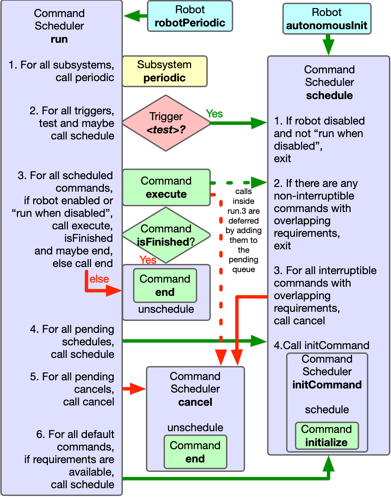
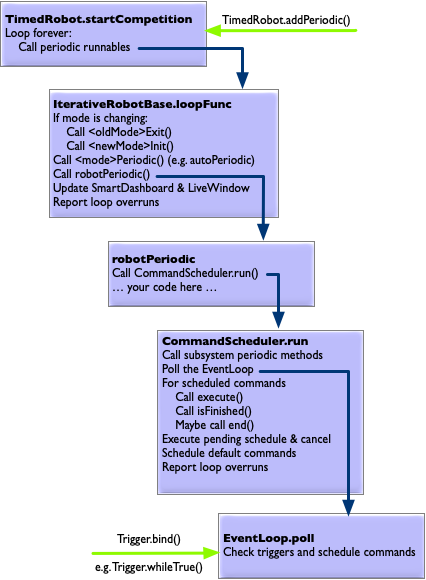

# CommandScheduler

When you are first taught to program, you are usually shown what is called the "imperative" style.
That means that you are in control of what happens when.
In a command-based robot, you have to use an "event-driven" style.
You must learn how to break your code up into small pieces that execute quickly and rely on the `CommandScheduler` to call them at the right time.  

<figure style="width: 50%; float:right;">
<figcaption>This shows the workflow of the CommandScheduler in Java.  The C++ implemention has almost identical behaviour.  This diagram dooes not show command event methods</figcaption>
</figure>

The `CommandScheduler` will manage commands, calling their four lifecycle methods (`initialize`, `execute`, `isFinished`, `end`).
It will also call the `periodic` methods of your subsystems and test any triggers you may have (mostly this will be joystick buttons).
It is also responsible for managing the requirements of commands, so two commands with overlapping requirements are never scheduled at the same time.

There are a number of ways to invoke the `CommandScheduler`:

## `CommandScheduler`<wbr/>`.getInstance()`<wbr/>`.run()`
* This makes the `CommandScheduler` perform its main loop for subsystems, triggers, and commands.
* This should be called from `Robot.robotPeriodic` and nowhere else.
* Most commands will not run while the robot is disabled, so will be automatically cancelled.

## `Trigger` methods
* After you have bound a `Command` to a `Trigger`, the `CommandScheduler` will then test the trigger automatically every iteration.  When the trigger activates, it will call `schedule` on the command.
* You're probably already using `Trigger`s in the form of joystick buttons.

## `Command.schedule()`
* Attempts to add the command to the list of scheduled commands.
* If a scheduled command has overlapping requirements, then either the other commands will be cancelled or if the other commands are non-interruptible (rare), then the attempt will fail.
* This should be called by `Robot.automomousInit` to set the autonomous command.
* It's fairly rare for teams to call `schedule` in any other context.  The main example is a pattern where you create a state machine by having each state be a separate command, with all of them sharing the same requirements, but it is usually better to [do the scheduling indirectly via `Trigger`s](/best-practices.html).  Outside that, if you find yourself wanting to call this anywhere else, you're probably doing something wrong.
* Calls to `schedule` from inside a command lifecycle method are deferred until after all the scheduled commands have been run.

## `Command.cance()`
* Unschedules the command
* May cause a default command to be scheduled
* It is common to call `cancel` on the autonomous command inside `Robot.teleopInit`.
* There is also `CommandScheduler.getInstance().cancelAll
* Calls to `cancel` from inside a command lifecycle method are deferred until after all the scheduled commands have been run, and after all the pending schedules have been scheduled.
* It's pretty rare to have to call this.  If you find yourself wanting to call this anywhere else, you're probably doing something wrong.

## Putting it all together

<figure style="width: 50%; float:right;">
<figcaption>This shows everything that is running in the robot's main event loop.</figcaption>
</figure>

This is a rough outline of how everything gets run.

`TimedRobot.startCompetition` has an endless loop which polls its time-based priority queue for callbacks that are ready to run.
`Runnable`s are added to that priority queue using `TimedRobot.addPeriodic`.
By default, the only thing on that queue is `IterativeRobotBase.loopFunc`.

`IterativeRobotBase.loopFunc` does:
1. Calls `<oldMode>Exit` and `<newMode>Init` if the mode is changing
2. Calls `<mode>Periodic` (e.g. `autoPeriodic` and `telopPeriodic`)
3. Calls `robotPeriodic`
4. Updates `SmartDashbaord` and `LiveWindow` properties
5. Does loop overrun reporting

By default, the only thing `robotPeriodic` does is to call `CommandScheduler.run`.

`CommandScheduler.run` does the following:
1. Calls subsystem `periodic` methods
2. Polls its `EventLoop`
3. For all scheduled commands, call `execute`, `isFinished` and/or possibly `end`.
4. Enact pending calls to `schedule` and `cancel`
5. Schedule default commands
6. Does its own loop overrun reporting

When `EventLoop.poll` is called, it runs every registered Runnable.
Runnables are registered using `EventLoop.bind`.
By default, the only way `Runnable`s are added to the `CommandScheduler`'s `EventLoop` is by calling one of the binding methods on a `Trigger`.

{% include note.html content="You can call `Robot.addPeriodic`  to add your own periodic tasks, possibly with a different period.  Don't rely on being able to use periods shorter than the main loop period of 20ms, because it's all running in the same thread.  Periodic methods registered with `addPeriodic` are not subject to overrun reporting, so you may not notice if they're causing performance problems.  

If you are confident about thread-safe programming,
you could also use [`Notifier`s](https://github.wpilib.org/allwpilib/docs/release/java/edu/wpi/first/wpilibj/Notifier.html)." %}

## See also
* [The Command Scheduler](https://docs.wpilib.org/en/stable/docs/software/commandbased/command-scheduler.html)

